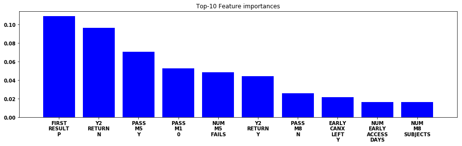
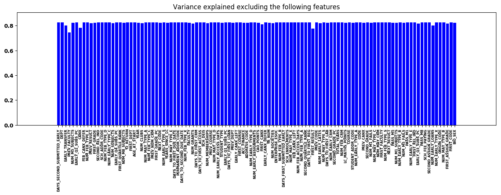

# Analysis on Student Data

## Data

| Number of students | Number of fields |
| :-------------: | :-------------:|
| 16,786 | 137 |

[List of fields](fields.md)

## Notebooks

1. [EDA](notebooks/EDA.ipynb)
2. [Correlations & Scatter plots](notebooks/Scatter%20%26%20Correlations.ipynb)
3. [Features](notebooks/Features.ipynb)
4. [Split the data](notebooks/Split%20train%20%26%20test%20sets.ipynb)
5. [Decision Tree](notebooks/Modelling%20a%20Decision%20Tree.ipynb)
6. [Random Forest](notebooks/Modelling%20a%20Random%20Forest.ipynb)
7. [Linear Models & Ablation studies](notebooks/Ablation%20Study.ipynb)

## Tutorials

* [Intro to NetworkX](notebooks/Intro%20to%20Networkx.ipynb)
* [Intro to UMAP](notebooks/Intro%20to%UMAP.ipynb)
* [Intro to Embeddings](notebooks/Intro%20to%Embeddings.ipynb)

You can always view a notebook using https://nbviewer.jupyter.org/

## Figures

EDA: Exploring CAO Points

Correlations:

Scatter plot: CAO Points vs Leving Cert Math Points

Decision Tree:

Random Forest: Top 10 Most Important Features

Linear Model: Ablation Study by Excluding Features

